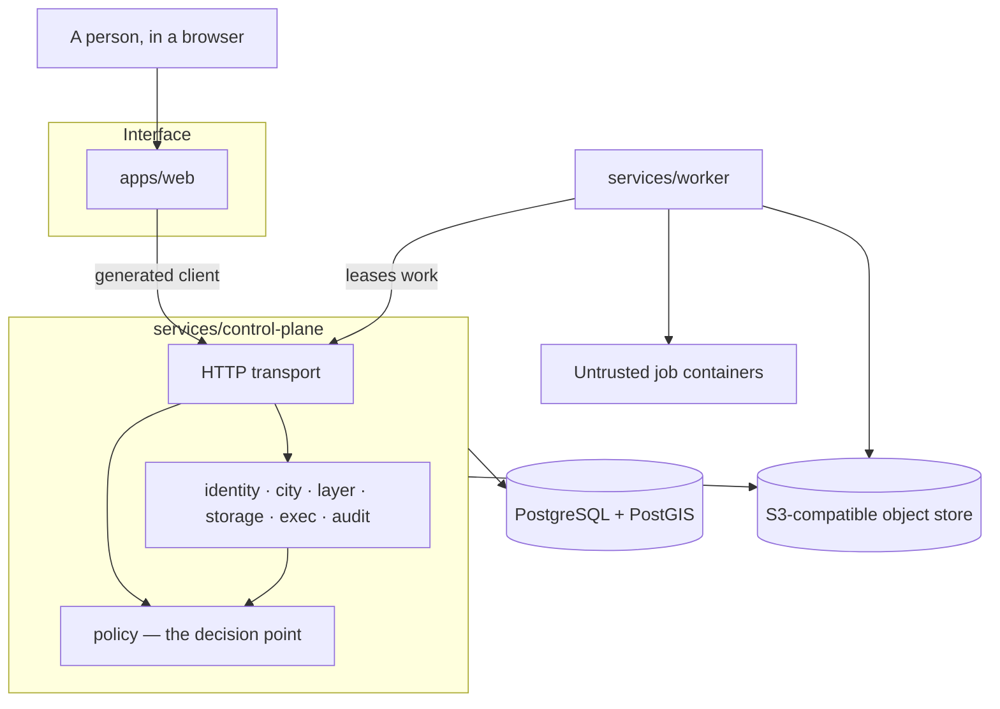
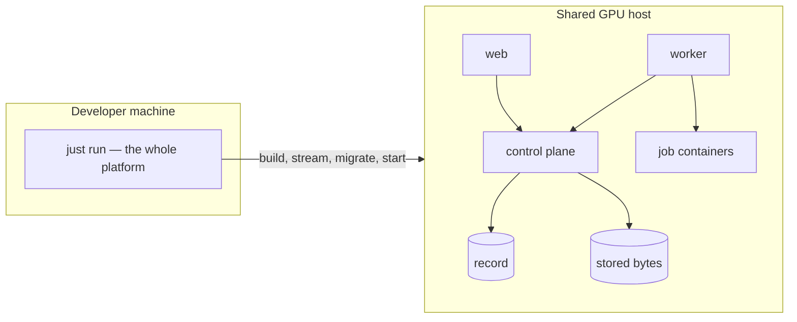

# System architecture

This describes what exists and what it owns. Technology choices are recorded in
[`docs/decisions`](decisions/README.md); what is deliberately not built yet is in
[`docs/plan/r1.md`](plan/r1.md).

## The object model

```
platform
├── layer/{id}@{version}   global scope: bathymetry, ocean forecast, weather
│
├── city/{id}              a bounded, curated, navigable place
│   └── layer/{id}@{v}     city scope: survey-grade content
│
└── org/{id}               an institution: members, quota, and its own work

grant:  org | principal ──[role, discoverability]──> city
```

City and organisation are siblings under the platform. Containment and
attribution are separate: a contributed layer is *contained by* the place and
*attributed to* the institution, which is why promoting it moves nothing.

## Components that exist



Every arrow into the product passes through the decision point. There is no
second one, and no component holds a handle to the binding tables except that
one.

## Components that do not exist yet

Reconstruction and model workflows, the Isaac Sim and ROS 2 integrations, the
field edge station, and the Kubernetes, Slurm, and HPC execution targets. The
interface each will attach to exists — a job is a container with checksummed
inputs and declared outputs; an execution target is one Go interface — but the
adapters do not.

## Ownership boundaries

**The interface** presents information and requests outcomes. It receives no
cluster credentials, writes to no store, starts no containers, and reaches bytes
only through short-lived URLs the platform issues.

**The control plane** owns identity, governance, places, layers, provenance,
work, and the record of all of it. It runs no scientific work: it admits work,
and workers run it.

**The worker** holds authority over the work queue and over nothing else. It
cannot read a place, contribute a layer, or act for an institution; everything
it touches while running a job, it reaches through the lease it holds on that
job.

**The data plane** keeps metadata and immutable bytes independently of any
compute provider. Identity is the content digest, so it survives moving between
stores.

## Deployment



Both deployments run the same components in the same shape. The GPU host is a
shared workstation, so every container there declares a limit and images are
streamed rather than pulled.

## Canonical information flow

```text
observe → ingest → verify → version → publish → promote
        → reconstruct → predict → simulate → evaluate → approve → deploy → observe again
```

Everything up to *promote* is built. Every transition produces a record, and no
downstream component may erase or obscure the origin and truth class of its
input.

## Decisions still to make

- Environmental model adapter boundaries.
- Brokering across Kubernetes, Slurm, and institutional HPC.
- Isaac Sim and ROS 2 versions.
- Field-edge safety authority and offline synchronisation.
- Data retention: nothing is deletable today, which is correct for evidence and
  will not remain sufficient for derived output.
