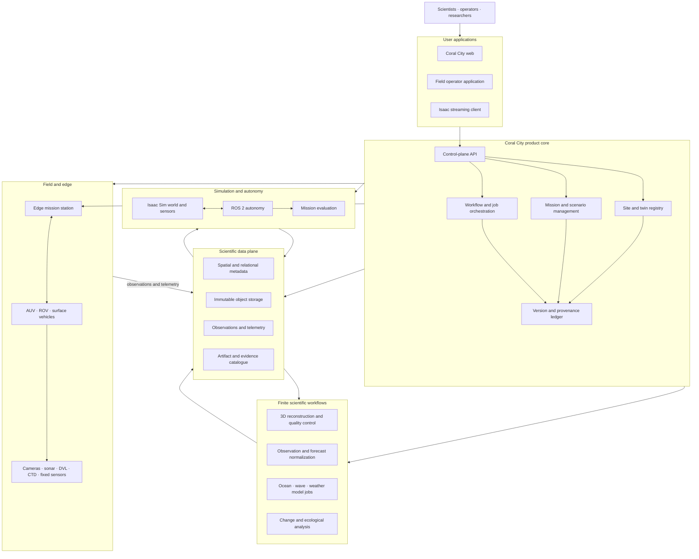
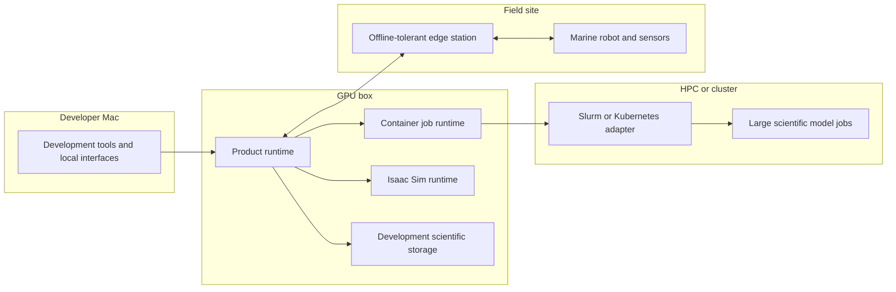

# System architecture

This document defines component ownership and information flow. Programming
language, monorepo tooling, and product-surface decisions are recorded in
[`docs/decisions`](decisions/README.md). Frameworks, databases, cloud vendors,
and scientific thresholds still require separate review records.

## Complete system



## Deployment view



## Ownership boundaries

### Applications

Applications present information and request outcomes. They do not receive
cluster credentials, write directly to scientific storage, start unmanaged
containers, or bypass mission safety policy.

### Control plane

The control plane owns identity, authorization, sites, missions, scenarios,
workflow state, job state, simulator sessions, publication state, and
provenance. It starts as one modular service. Splitting it into networked
microservices requires measured operational justification.

### Scientific data plane

The data plane preserves metadata and immutable scientific bytes independently
of any simulator or compute provider. Large data remains outside Git and is
addressed by versioned manifests and checksums.

### Workflows

Reconstruction, environmental normalization, model execution, and analysis are
finite jobs. They consume declared inputs, emit declared outputs, preserve
native logs and results, and exit. They do not become permanent product APIs.

### Integrations

Isaac, ROS 2, and scientific-model adapters translate Coral City contracts into
runtime-native forms. Integration code remains thin enough that a runtime can
be upgraded or replaced without rewriting the product core.

### Field edge

The field edge owns vehicle safety, immediate control, mission execution, and
offline operation. Cloud or GPU connectivity may enhance a mission but must not
be required for emergency control or safe termination.

## Canonical information flow

```text
observe → ingest → validate → version → reconstruct/assimilate
        → predict → simulate → evaluate → approve → deploy → observe again
```

Every transition produces an evidence record. No downstream component is
allowed to erase or obscure the origin and truth class of its input.

## Repository-to-runtime mapping

| Repository area | Runtime meaning |
| --- | --- |
| `apps/` | Long-running user-facing processes |
| `services/` | Long-running Coral City product processes |
| `packages/` | Versioned contracts and reusable client code |
| `workflows/` | Finite, retryable jobs |
| `integrations/` | Runtime boundary adapters and plugins |
| `deployments/` | Desired deployment state and operational configuration |
| `catalog/` | Small manifests that point to external scientific bytes |

## Decisions intentionally deferred

- Web application framework
- API style and schema technology
- Metadata, object, and time-series storage products
- Workflow engine and scheduler
- Container build and registry strategy
- HPC adapter and target institution
- Authentication provider
- Geospatial, temporal, and uncertainty thresholds
- Exact Isaac Sim and ROS 2 versions

Each choice will be proposed, explained, and approved through a decision record
before implementation.
