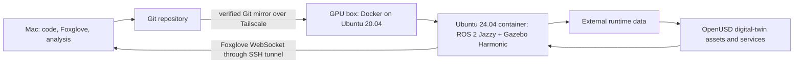

# Laboratory architecture

The Mac is the control and visualization surface. The GPU box is a replaceable
execution target, not the source of truth.

## Boundaries

- The host operating system provides Docker, NVIDIA drivers, storage, and
  networking. Project dependencies are not installed directly on it.
- The container owns ROS, Gazebo, bridge processes, and development tools.
- The repository owns source, small assets, configuration, and documentation.
- `/data` owns recordings, datasets, model weights, and generated artifacts.
- Simulation truth is available to evaluation tooling but not to autonomy nodes.
- Digital-twin source data, derived assets, and runtime state are distinct;
  OpenUSD scenes never become the only copy of scientific observations.

## Networking

The container uses host networking so ROS discovery remains local to the GPU
box. The Mac does not join the ROS DDS domain directly. Foxglove Bridge exposes
one WebSocket endpoint on remote port 8765, forwarded to the Mac through SSH on
local port 18765. Keeping the ports distinct avoids a known local conflict with
Claude Science's default application port.

## Visualization

Foxglove is the daily interface for transforms, robot geometry, camera feeds,
sonar, maps, plots, controls, and playback. Gazebo uses EGL for GPU rendering
without an X server. A separate streamed graphical path exposes native
simulator interfaces when world editing and inspection require them. Project
002 will use Isaac Sim's supported remote-streaming path rather than inheriting
Stonefish's Xpra setup.

The detailed Project 002 system boundary is documented in
[`projects/002_red_sea_digital_twin/architecture.md`](../projects/002_red_sea_digital_twin/architecture.md).
