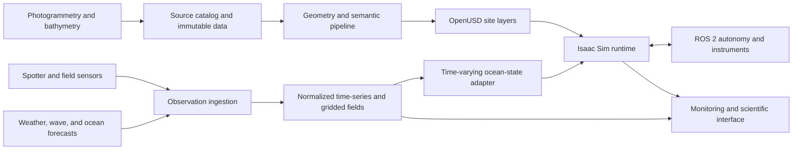

# Architecture

## System shape



## Canonical layers

| Layer | Examples | Source of truth |
| --- | --- | --- |
| Site | terrain, reef mesh, dive infrastructure | asset catalog + OpenUSD |
| Semantics | coral colony, substrate, species, condition | versioned annotations |
| Environment | wind, waves, currents, temperature, turbidity | observation/forecast store |
| Ecology | surveys, bleaching, growth, mortality | ecological records |
| Robotics | AUVs, sensors, frames, controllers | USD/URDF + ROS 2 packages |
| Scenario | timestamp, site, model run, mission, random seed | scenario manifest |

## Coordinate strategy

The catalog stores global positions in WGS84. Each site declares a stable local
East-North-Up engineering frame and the transform that anchors it globally.
Simulation occurs in that local frame to avoid floating-point problems. A site
must not be imported until its scale, orientation, depth sign, vertical datum,
and anchor uncertainty are documented.

## Time and truth classes

Every environmental value carries a timestamp and one of these truth classes:

- `observation`: directly measured or derived from a measurement;
- `analysis`: assimilated or reconstructed best estimate;
- `forecast`: model prediction issued at a known time;
- `scenario`: intentionally synthetic input; or
- `simulation`: output produced by this project.

The user interface must preserve these distinctions.

## Runtime boundary

Isaac Sim consumes prepared geometry and sampled environmental state. It may
visualize fields or apply them as forces and sensor conditions, but it does not
become the archive for scientific data or the basin-scale ocean solver.

ROS 2 receives only the measurements that the simulated vehicle would have.
Ground truth is available to evaluation tooling on a separate interface.

## Clean growth boundaries

The project grows as a set of bounded areas. Dependencies point inward toward
contracts; external tools do not become the architecture.

```text
projects/002_red_sea_digital_twin/
├── assets/         measured and synthetic 3D source manifests
├── pipelines/      reconstruction and data-processing workflows
├── models/         scientific-model registry, adapters, recipes, validation
├── services/       catalog, state, orchestration, and API services
├── extensions/     thin Isaac Sim presentation and sensor integrations
├── scenarios/      immutable, replayable experiment manifests
├── platform/       runtime, deployment, storage, and operational evidence
└── website/        human-readable program blueprint and later mission control
```

Shared schemas define sites, observations, environment packages, vehicles,
missions, and evidence. A package may depend on those schemas, but the schemas
do not depend on a simulator, scientific solver, cloud service, or user
interface.

## Scientific model boundary

OpenDrift, SWAN, HYSPLIT, WAVEWATCH III, SCHISM, FABM/ERSEM/GOTM, MITgcm,
ADCIRC, WRF/WPS, and Delft3D are candidate engines behind adapters. They do not
write directly into Isaac Sim or ROS 2.

Each adapter accepts a versioned run request and emits one canonical
Environment Package containing coordinates, time, variables, units,
uncertainty, truth class, checksums, and provenance. Native model files remain
available for scientific audit. NetCDF or Zarr carries numerical arrays; a
small manifest connects them to a site and scenario.

This boundary allows the program to begin with downloaded forecasts and one
lightweight model, then add regional or HPC solvers without changing the reef,
robotics, mission, or user-interface layers. See [the model federation
contract](models/README.md) and [candidate registry](models/registry.yaml).
