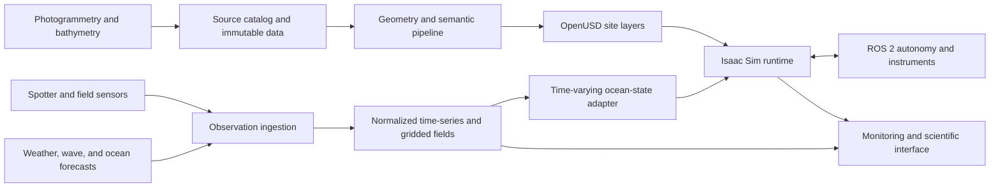

# Architecture

## System shape

## Canonical layers

| Layer | Examples | Source of truth |
| --- | --- | --- |
| Site | terrain, reef mesh, dive infrastructure | asset catalog + OpenUSD |
| Semantics | coral colony, substrate, species, condition | versioned annotations |
| Environment | wind, waves, currents, temperature, turbidity | observation/forecast store |
| Ecology | surveys, bleaching, growth, mortality | ecological records |
| Robotics | AUVs, sensors, frames, controllers | USD/URDF + ROS 2 packages |
| Scenario | timestamp, site, model run, mission, random seed | scenario manifest |

## Coordinate strategy

The catalog stores global positions in WGS84. Each site declares a stable local
East-North-Up engineering frame and the transform that anchors it globally.
Simulation occurs in that local frame to avoid floating-point problems. A site
must not be imported until its scale, orientation, depth sign, vertical datum,
and anchor uncertainty are documented.

## Time and truth classes

Every environmental value carries a timestamp and one of these truth classes:

- `observation`: directly measured or derived from a measurement;
- `analysis`: assimilated or reconstructed best estimate;
- `forecast`: model prediction issued at a known time;
- `scenario`: intentionally synthetic input; or
- `simulation`: output produced by this project.

The user interface must preserve these distinctions.

## Runtime boundary

Isaac Sim consumes prepared geometry and sampled environmental state. It may
visualize fields or apply them as forces and sensor conditions, but it does not
become the archive for scientific data or the basin-scale ocean solver.

ROS 2 receives only the measurements that the simulated vehicle would have.
Ground truth is available to evaluation tooling on a separate interface.
